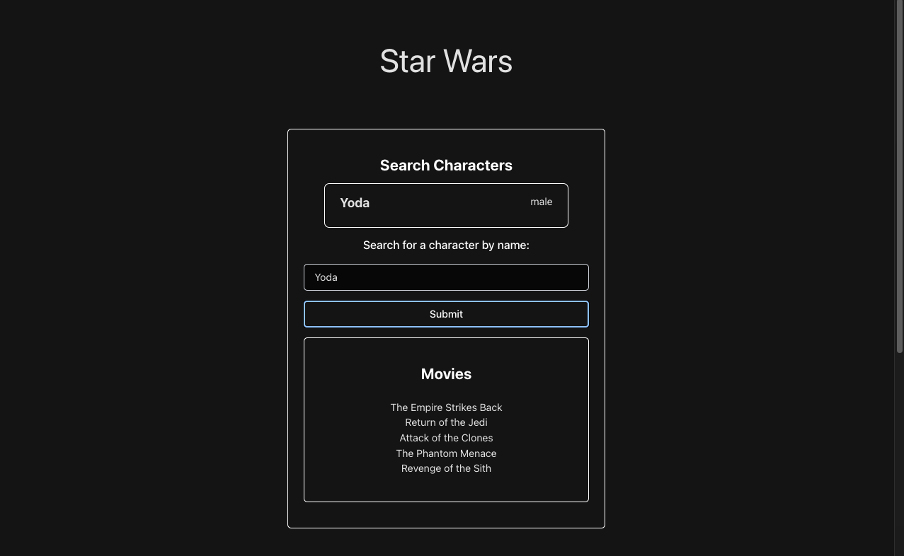
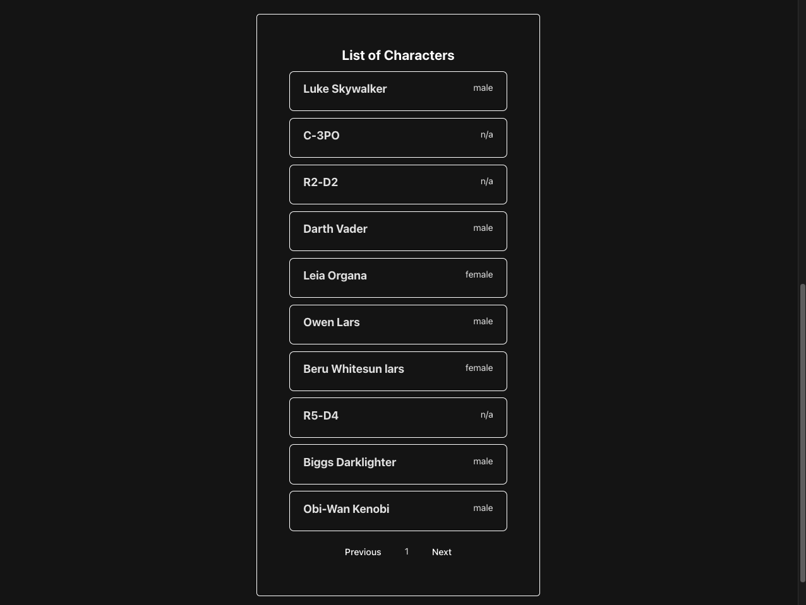

# starwars

This project contains a simple React single-page application showcasing Star Wars characters and relevant movies.

## Features

1. Search Characters

- Input the name of the character to display their personal data and movies they are in.
    - If the name submitted into the form is capital letters (all) then it will only show exact matches.
- Address User Stories #2, #3

2. List of Characters

- Displays every characters in Star Wars, 10 at a time.
- Click on the `Previous` or `Next` buttons to navigate the list.
  - Only 10 characters' data is fetched at a time.
- Addresses User Stories #1, #4

## User Stories

1. As someone who isn't familiar with the Star Wars franchise, I want to be shown a list of Star Wars characters so that I know what I'm in for.

- API endpoint: GET /people
- Display important information: "name", "gender"

2. As someone who is only vaguely familiar with the names of famous Star Wars characters, I want to be able to perform a search to find them by name.

- API endpoint: GET /people?search=<name>

3. As someone who is a little too interested in a particular character, I want to know what movies they are in so that I can watch those first.

- API endpoints:
  - GET /people?search=<name>
  - GET using the URLs under "films" field

4. As someone who owns a very low-end device, I don't want every single result on my screen, it makes my phone lag, but it seems my phone can only handle 10 at a time!
